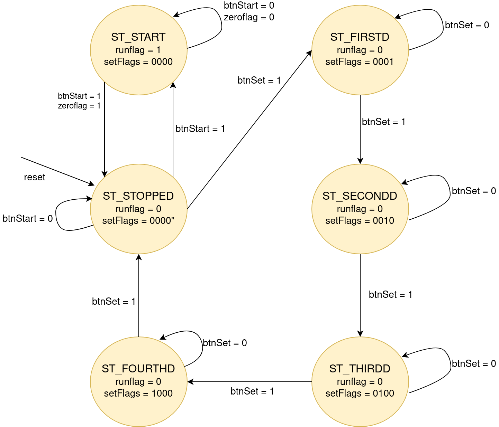

# Count Down Timer

Develop timer only based on Hardware.

Using pulse generator, Control Unit (Finite State Machine), reset module shared by all the components and using a datapath.

[Architecture](https://github.com/catarinaacsilva/vivado-xilinx-tutorials/blob/master/Timer/architecture/Architecture.pdf)

Interaction with the system:

- Buttons (set, up, down, reset, cpu_reset)
- Display
- Leds

**Control Unit (Finite State Machine):**

## Requirements

- Vivado 2019.2
- FPGA

## Installation

Follow these [steps](https://github.com/catarinaacsilva/vivado-xilinx-tutorials/blob/master/initial_project/README.md) to create a Vivado simple project.

## Authors

* **Catarina Silva** - [catarinaacsilva](https://github.com/catarinaacsilva)

## License

This project is licensed under the MIT License - see the [LICENSE](LICENSE) file for details